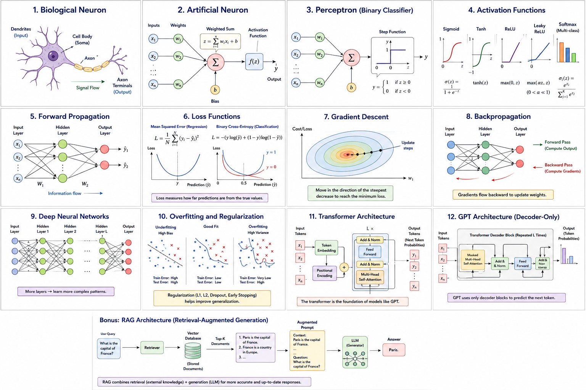

# 3.0 Visual Roadmap

Before diving into the details, examine the complete roadmap of concepts covered in Part III and beyond.

<figure>
    

<figcaption>

Figure 3.0.1 — Complete roadmap from neurons to GPT.

</figcaption>
</figure>

As you progress through the textbook, revisit this figure periodically to connect new concepts with the larger AI ecosystem.