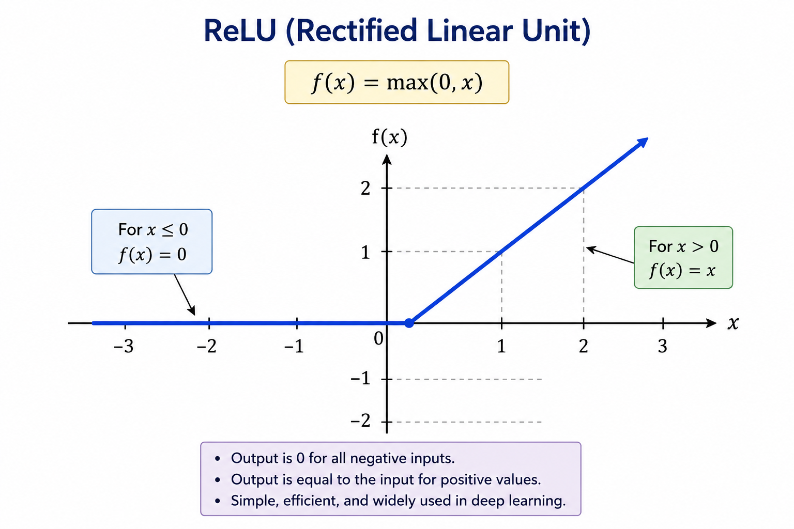

# 3.4 Activation Functions

## Learning Objectives

By the end of this chapter, you should be able to:

* Understand why activation functions are needed.
* Explain the limitations of neurons without activation functions.
* Understand linear and non-linear relationships.
* Describe Sigmoid, Tanh, ReLU, Leaky ReLU, and Softmax.
* Understand why ReLU became the dominant activation function in deep learning.
* Explain how activation functions make modern AI possible.
* Connect activation functions to Transformers and GPT.

---

# Why Do We Need Activation Functions?

In the previous chapters, we learned that a neuron performs:

```text
Inputs
   ↓
Weights
   ↓
Weighted Sum
   ↓
Bias
   ↓
Output
```

Mathematically:

```text
z = w₁x₁ + w₂x₂ + ... + b
```

At first glance, this seems sufficient.

However, there is a major problem.

---

# The Linear Problem

Suppose every neuron only performs:

```text
Weighted Sum
```

with no activation function.

Then:

```text
Layer 1
   ↓
Layer 2
   ↓
Layer 3
```

can always be simplified into:

```text
One Single Layer
```

No matter how many layers you add.

---

> [!IMPORTANT]
> A network made entirely of linear operations is mathematically equivalent to a single linear operation.

---

This means:

```text
More Layers
≠
More Intelligence
```

Without activation functions, deep learning would not exist.

---

# Understanding Linear Relationships

Consider:

```text
Salary = Hours Worked × Rate
```

If hours double:

```text
Salary Doubles
```

This is a linear relationship.

Graphically:

```text
Straight Line
```

---

Linear relationships are predictable and simple.

Many real-world problems are not.

---

# Understanding Non-Linear Relationships

Consider:

```text
Exam Score
```

versus

```text
Hours Studied
```

Initially:

```text
More Study
→
Better Scores
```

But eventually:

```text
Too Much Study
→
Diminishing Returns
```

This relationship is not a straight line.

It is nonlinear.

---

Modern AI must model:

* Language
* Vision
* Speech
* Reasoning
* Human behavior

These are highly nonlinear problems.

---

# What Is an Activation Function?

An activation function transforms a neuron's output.

Instead of:

```text
Output = z
```

we compute:

```text
Output = f(z)
```

where:

```text
f
```

is the activation function.

---

The complete neuron becomes:

```text
Inputs
   ↓
Weights
   ↓
Weighted Sum
   ↓
Bias
   ↓
Activation Function
   ↓
Output
```

---

# Why Activation Functions Matter

Activation functions introduce:

```text
Non-Linearity
```

This allows neural networks to learn complex patterns.

Without activation functions:

```text
Deep Learning
Impossible
```

With activation functions:

```text
Deep Learning
Possible
```

---

# The Sigmoid Function

One of the earliest activation functions.

Formula:

```text
σ(z) = 1 / (1 + e⁻ᶻ)
```

Visual intuition:

```text
0 ─────╮
       │
       │
       ╰──── 1
```

An S-shaped curve.

---

Properties:

```text
Output Range

0 to 1
```

Useful for probabilities.

Example:

```text
0.95
```

can be interpreted as:

```text
95% Confidence
```

---

### Sigmoid Formula Visualization

---

# Problems with Sigmoid

As networks became deeper, researchers discovered issues.

Large positive values:

```text
Output ≈ 1
```

Large negative values:

```text
Output ≈ 0
```

The curve becomes very flat.

This leads to:

```text
Vanishing Gradients
```

which slows learning.

---

# The Tanh Function

Formula:

```text
tanh(z)
```

Output range:

```text
-1 to 1
```

Unlike sigmoid:

```text
Centered Around Zero
```

---

Visualization:

```text
      1
     ╱
----╱----
   ╱
 -1
```

---

### Tanh Visualization

---

Advantages:

* Zero-centered output.
* Often learns faster than sigmoid.
* Better gradient flow.

---

However:

```text
Still Suffers
From Vanishing Gradients
```

---

# The Deep Learning Revolution

By the early 2000s, neural networks often struggled to train.

Researchers needed a better activation function.

The breakthrough was:

```text
ReLU
```

---

# ReLU (Rectified Linear Unit)

Formula:

```text
f(z) = max(0, z)
```

Meaning:

```text
Negative Values → 0

Positive Values → Unchanged
```

Examples:

```text
ReLU(-5) = 0

ReLU(3) = 3

ReLU(10) = 10
```

---

### ReLU Visualization

y=max(0,x)

---

Graphically:



---

# Why ReLU Changed Everything

ReLU solved many problems.

Advantages:

* Simple computation.
* Fast training.
* Reduced vanishing gradients.
* Works well in deep networks.

This activation function helped trigger the deep learning revolution.

---

> [!IMPORTANT]
> Without ReLU, modern deep learning would likely not have progressed as rapidly.

---

# The Dying ReLU Problem

ReLU has a weakness.

If a neuron receives large negative inputs repeatedly:

```text
Output = 0
```

forever.

The neuron effectively stops learning.

This is called:

```text
Dying ReLU
```

---

# Leaky ReLU

To solve the Dying ReLU problem:

```text
Negative Values
```

are allowed to pass through slightly.

Formula:

```text
f(z) = max(αz, z)
```

where:

```text
α
```

is a small value.

Example:

```text
0.01
```

---

Graphically:

```text
      /
     /
----/
   /
```

The negative side now has a small slope.

---

# Why Leaky ReLU Helps

Instead of:

```text
Negative Output = 0
```

we get:

```text
Small Negative Output
```

This allows gradients to continue flowing.

Learning continues.

---

# Softmax

Sigmoid works well for:

```text
Yes / No
```

problems.

But what if we have:

```text
Dog
Cat
Horse
Bird
```

?

We need probabilities across multiple classes.

---

Softmax converts numbers into probabilities.

Example:

Input:

```text
Dog = 5

Cat = 3

Bird = 1
```

Softmax Output:

```text
Dog  = 0.84

Cat  = 0.11

Bird = 0.05
```

Notice:

```text
All Probabilities Sum To 1
```

---

# Why Softmax Is Useful

Softmax answers:

> Which class is most likely?

Applications:

* Image classification
* Spam detection
* Language tasks
* Token prediction

---

# Activation Functions in GPT

Modern Transformers primarily use:

```text
ReLU Variants
```

or

```text
GELU
```

inside feed-forward layers.

Why?

Because they:

* Train efficiently.
* Preserve useful gradients.
* Scale to massive models.

---

GPT still relies on the same fundamental idea:

```text
Weighted Sum
      ↓
Activation Function
      ↓
Learn Complex Patterns
```

The scale changed.

The principle did not.

---

# Comparison of Activation Functions

| Function   | Output Range | Main Use                       | Problem             |
| ---------- | ------------ | ------------------------------ | ------------------- |
| Sigmoid    | 0 to 1       | Probabilities                  | Vanishing gradients |
| Tanh       | -1 to 1      | Hidden layers (older networks) | Vanishing gradients |
| ReLU       | 0 to ∞       | Deep learning                  | Dying ReLU          |
| Leaky ReLU | -∞ to ∞      | Improved ReLU                  | Slight complexity   |
| Softmax    | 0 to 1       | Multi-class output             | Output layer only   |

---

# Real-World Analogy

Imagine a hiring process.

Inputs:

```text
Experience
Education
Skills
Interview Score
```

The weighted sum combines all information.

The activation function acts like a decision policy.

Example:

```text
Reject

Maybe

Hire
```

It determines how the raw score becomes a meaningful decision.

---

# Common Misconceptions

## Misconception 1

Activation functions are optional.

Reality:

Without them, deep learning collapses into a linear model.

---

## Misconception 2

More layers automatically increase intelligence.

Reality:

Layers require activation functions to gain expressive power.

---

## Misconception 3

ReLU is perfect.

Reality:

ReLU has limitations and variants exist to address them.

---

# Key Takeaways

* Activation functions introduce non-linearity.
* Non-linearity enables deep learning.
* Sigmoid outputs values between 0 and 1.
* Tanh outputs values between -1 and 1.
* ReLU became the dominant activation function for deep learning.
* Leaky ReLU helps solve the Dying ReLU problem.
* Softmax converts outputs into probabilities.
* Modern AI systems still rely heavily on activation functions.

---

# Interview Questions

## Beginner

1. What is an activation function?
2. Why do neural networks need activation functions?
3. What is ReLU?

## Intermediate

4. What is the difference between Sigmoid and Tanh?
5. What is the Dying ReLU problem?
6. Why is Softmax used for classification?

## Advanced

7. Explain why deep networks without activation functions are equivalent to linear models.
8. Why did ReLU accelerate deep learning?
9. How do activation functions contribute to GPT?

---

# Exercises

1. Calculate outputs using Sigmoid for different values.
2. Compare Tanh and Sigmoid outputs.
3. Plot ReLU for positive and negative values.
4. Research GELU and compare it with ReLU.
5. Explain why Softmax probabilities always sum to 1.

---

# Chapter Summary

Activation functions transformed neural networks from simple linear models into powerful systems capable of learning complex patterns.

They introduce non-linearity, enabling deep learning, computer vision, natural language processing, and modern Large Language Models.

Although many activation functions have been proposed over the years, ReLU and its variants became foundational to modern AI, while Softmax remains essential for classification tasks.

---

# Preview of Chapter 3.5

In the next chapter, we will study Forward Propagation.

We will learn:

* How information flows through a neural network
* Layer-by-layer computation
* Hidden layers
* Output generation
* The complete prediction process used by neural networks and LLMs

Forward propagation is where neural networks actually "think" using the weights they have learned.
