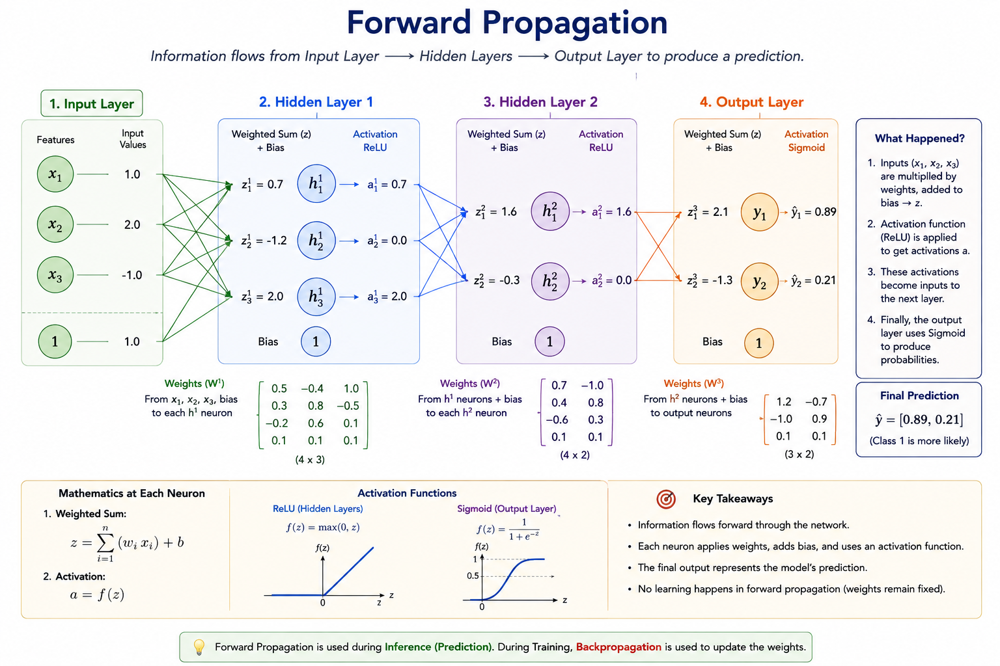

# 3.5 Forward Propagation

## Learning Objectives

By the end of this chapter, you should be able to:

* Understand what forward propagation is.
* Follow data as it moves through a neural network.
* Understand input, hidden, and output layers.
* Perform a simple forward propagation calculation.
* Understand how predictions are generated.
* Connect forward propagation to Transformers and GPT.
* Understand why forward propagation is called the inference process.

---

# Introduction

In the previous chapters, we learned:

* Artificial Neurons
* Perceptrons
* Activation Functions

Now we are ready to answer an important question:

> How does a neural network actually make a prediction?

The answer is:

```text
Forward Propagation
```

Every prediction made by ChatGPT, GPT-4, Gemini, Claude, or any neural network begins with forward propagation.

---

# What Is Forward Propagation?

Forward propagation is the process of moving information through a neural network from input to output.

Conceptually:

```text
Input
  ↓
Hidden Layer
  ↓
Hidden Layer
  ↓
Output
```

The information always moves:

```text
Left → Right
```

or

```text
Input → Output
```

Hence the name:

```text
Forward Propagation
```

---

# Real-World Analogy

Imagine applying for a loan.

Information:

```text
Income
Age
Credit Score
Employment History
```

goes through several stages of evaluation.

```text
Application
      ↓
Review Team
      ↓
Risk Assessment
      ↓
Approval Team
      ↓
Decision
```

Each stage processes information and passes it forward.

A neural network behaves similarly.

---

# Neural Network Architecture

Consider a simple network:

```text
Input Layer
     ↓
Hidden Layer
     ↓
Output Layer
```

Visualized:

```text
x₁ ──┐
     │
x₂ ──┼──► Hidden Neurons ───► Output
     │
x₃ ──┘
```

Every neuron receives inputs and produces outputs.

---

# The Three Types of Layers

## Input Layer

Receives raw data.

Examples:

```text
Age
Salary
Height
Weight
```

or

```text
Word Embeddings
```

for language models.

The input layer performs no learning.

It simply passes data forward.

---

## Hidden Layers

Hidden layers perform computation.

They:

* Apply weights
* Add biases
* Apply activation functions

Most intelligence emerges here.

Example:

```text
Input
  ↓
Hidden Layer 1
  ↓
Hidden Layer 2
  ↓
Output
```

---

## Output Layer

Produces the final prediction.

Examples:

```text
Spam
Not Spam
```

or

```text
Dog
Cat
Bird
```

or

```text
Next Word Prediction
```

in GPT.

---

# A Simple Example

Suppose we have:

```text
Input 1 = 2

Input 2 = 3
```

Weights:

```text
w₁ = 0.5

w₂ = 0.8
```

Bias:

```text
b = 1
```

---

# Step 1: Calculate Weighted Sum

Formula:

```text
z = w₁x₁ + w₂x₂ + b
```

Substituting values:

```text
z

=

(0.5 × 2)

+

(0.8 × 3)

+

1
```

Result:

```text
1.0

+

2.4

+

1

=

4.4
```

---

# Step 2: Apply Activation Function

Suppose we use ReLU.

Formula:

```text
ReLU(z)

=

max(0,z)
```

Result:

```text
max(0,4.4)

=

4.4
```

Output:

```text
4.4
```

This becomes the input for the next layer.

---

# Layer-by-Layer Processing

Forward propagation is repeated at every layer.

Example:

```text
Input Layer
      ↓
Layer 1 Output
      ↓
Layer 2 Output
      ↓
Layer 3 Output
      ↓
Final Prediction
```

Each layer transforms the information.

---

# Visualizing Forward Propagation

```text
Inputs
   ↓
Weighted Sum
   ↓
Activation
   ↓
Hidden Layer
   ↓
Weighted Sum
   ↓
Activation
   ↓
Output
```

This flow continues until the final layer.

---

## Forward Propagation Example Diagram

The following figure shows a complete forward propagation pass through a neural network.

Notice how information flows from the input layer through hidden layers and finally reaches the output layer.

At each neuron:

1. Inputs are multiplied by weights.
2. A bias is added.
3. An activation function is applied.
4. The output is passed to the next layer.

This process continues until a final prediction is produced.

<figure>
    

<figcaption>

Figure 3.5.1 — Forward propagation through a neural network. Inputs are transformed layer by layer until a final prediction is generated.

</figcaption>
</figure>

**Figure 3.5.1 at a glance**

- Inputs flow left to right.
- Hidden layers apply weights, biases, and ReLU.
- The output layer produces probabilities.
- No learning occurs during forward propagation.
- Learning happens later through backpropagation.

## Understanding Figure 3.5.1

Figure 3.5.1 shows a complete forward propagation pass through a neural network.

Although modern neural networks may contain millions or even billions of neurons, the fundamental process remains exactly the same.

The network receives inputs, processes them through hidden layers, and finally produces a prediction.

---

### Step 1: Input Layer

The process begins with the input features:

```text
x₁ = 1.0
x₂ = 2.0
x₃ = -1.0
```

These values represent information provided to the network.

Depending on the problem, inputs might represent:

* Customer information
* Pixel values from an image
* Sensor measurements
* Word embeddings in an LLM

The input layer does not perform any computation.

Its purpose is simply to provide data to the first hidden layer.

---

### Step 2: Hidden Layer 1

Each neuron receives all inputs.

For every neuron:

```text
Weighted Sum
      ↓
Add Bias
      ↓
Apply Activation Function
```

Mathematically:

```text
z = (w₁x₁ + w₂x₂ + w₃x₃) + b
```

The neuron then applies the ReLU activation function:

```text
ReLU(z) = max(0, z)
```

This means:

```text
Positive Values
      ↓
Remain Unchanged
```

```text
Negative Values
      ↓
Become Zero
```

For example:

```text
ReLU(3.5) = 3.5

ReLU(-2.1) = 0
```

The resulting outputs become inputs to the next layer.

---

### Step 3: Hidden Layer 2

The second hidden layer repeats exactly the same process.

Each neuron receives outputs from Hidden Layer 1 and computes:

```text
Weighted Sum
      ↓
Add Bias
      ↓
Apply ReLU
```

This layer learns more complex patterns than the first layer.

A useful way to think about hidden layers is:

```text
Earlier Layers
      ↓
Simple Patterns

Later Layers
      ↓
Complex Patterns
```

Each layer builds upon the work of the previous layer.

---

### Step 4: Output Layer

The final layer produces the network's prediction.

In Figure 3.5.1, the output layer uses the Sigmoid activation function:

```text
σ(z) = 1 / (1 + e⁻ᶻ)
```

Sigmoid converts raw numerical scores into probabilities.

Example:

```text
Raw Score = 2.1

Sigmoid Output = 0.89
```

This can be interpreted as:

```text
89% Confidence
```

for a particular class.

---

### Step 5: Final Prediction

The output layer produces:

```text
ŷ = [0.89, 0.21]
```

The network compares the probabilities:

```text
0.89 > 0.21
```

Therefore:

```text
Predicted Class = Class 1
```

The highest probability becomes the prediction.

---

## What the Network Is Actually Doing

At first glance, the diagram appears complicated.

However, every neuron performs only three operations:

```text
Multiply
      ↓
Add
      ↓
Activate
```

Nothing more.

The remarkable capability of neural networks emerges because these simple operations are repeated millions or billions of times.

---

## Why Hidden Layers Matter

Suppose the network contained only:

```text
Input Layer
      ↓
Output Layer
```

The model would be extremely limited.

Hidden layers allow the network to gradually build richer representations.

Conceptually:

```text
Raw Data
      ↓
Useful Features
      ↓
Higher-Level Features
      ↓
Prediction
```

This hierarchical learning is one of the key reasons deep learning is so powerful.

---

## Connection to GPT

The exact same idea exists inside GPT.

Instead of numerical features like:

```text
Age
Salary
Credit Score
```

GPT receives:

```text
Token Embeddings
```

The information then passes through many transformer layers:

```text
Embeddings
      ↓
Attention Layers
      ↓
Feed-Forward Layers
      ↓
Output Probabilities
```

Although GPT is far larger and more sophisticated, it still relies on forward propagation.

---

> [!IMPORTANT]
> Every response generated by ChatGPT is produced through forward propagation.
>
> During inference, the model does not learn or update its weights.
>
> It simply performs a forward pass through the network using the knowledge already stored in its parameters.

---

## The Key Insight

When studying modern AI, it is easy to become overwhelmed by terms such as:

* Deep Learning
* Transformers
* GPT
* Attention
* RAG

However, all of these systems ultimately rely on the same fundamental principle:

```text
Input
   ↓
Weighted Sum
   ↓
Activation Function
   ↓
Output
```

Forward propagation is the mechanism that transforms information into predictions and forms the foundation of every neural network.


---


> [!IMPORTANT]
> During forward propagation, the neural network does not learn.
>
> It simply uses the weights it has already learned to generate a prediction.
>
> Learning happens later during backpropagation.

---

# Multiple Hidden Neurons

Real neural networks contain many neurons.

Example:

```text
Input
   ↓

● ● ● ●

   ↓

● ● ● ●

   ↓

Output
```

Each neuron performs:

```text
Weighted Sum
+
Bias
+
Activation
```

simultaneously.

---

# Why Is It Called Propagation?

Because information propagates through the network.

Think of water flowing through pipes:

```text
Input
  ↓
Pipe
  ↓
Pipe
  ↓
Pipe
  ↓
Output
```

The information keeps moving forward.

---

# Forward Propagation in Image Recognition

Suppose we input an image.

Early layers learn:

```text
Edges
```

Later layers learn:

```text
Shapes
```

Even later layers learn:

```text
Objects
```

Example:

```text
Edges
   ↓
Eyes
   ↓
Face
   ↓
Person
```

The information becomes increasingly meaningful.

---

# Forward Propagation in Language Models

For GPT:

Input:

```text
The cat sat on the
```

Tokenized and embedded:

```text
Embeddings
```

Then:

```text
Embedding Layer
       ↓
Transformer Layers
       ↓
Prediction Layer
       ↓
Next Token
```

Output:

```text
mat
```

This entire process is forward propagation.

---

# Why Forward Propagation Matters

Forward propagation is how neural networks:

* Predict
* Classify
* Generate text
* Recognize images
* Understand speech

Without forward propagation:

```text
No Predictions
```

would be possible.

---

# Forward Propagation vs Learning

Many beginners confuse:

```text
Forward Propagation
```

with

```text
Learning
```

They are different.

Forward propagation:

```text
Uses Existing Weights
```

Backpropagation:

```text
Updates Weights
```

---

# Important Distinction

Forward propagation asks:

> What does the network currently believe?

Backpropagation asks:

> How should the network improve?

These two processes work together.

---

# During Training

Training cycle:

```text
Forward Propagation
         ↓
Prediction
         ↓
Calculate Error
         ↓
Backpropagation
         ↓
Update Weights
         ↓
Forward Propagation Again
```

This cycle repeats millions of times.

---

# During Inference

When ChatGPT answers a question:

```text
No Learning Occurs
```

Only:

```text
Forward Propagation
```

is performed.

This is called:

```text
Inference
```

---

# Why Inference Is Fast

The model already knows its weights.

Therefore:

```text
Input
  ↓
Forward Pass
  ↓
Prediction
```

No training required.

This makes deployment practical.

---

# Forward Propagation in GPT

Modern LLMs perform forward propagation through:

```text
Embedding Layers
        ↓
Attention Layers
        ↓
Feed Forward Layers
        ↓
Output Layer
```

Each token moves through dozens or hundreds of layers.

Yet the underlying principle remains unchanged.

---

# The Core Idea

Whether:

```text
Single Neuron
```

or

```text
GPT-5
```

the process remains:

```text
Input
   ↓
Weights
   ↓
Activation
   ↓
Output
```

The scale changes.

The mathematics remains the same.

---

> [!IMPORTANT]
> Every response generated by ChatGPT is the result of forward propagation through billions of learned parameters.

---

# Common Misconceptions

## Misconception 1

Forward propagation means learning.

Reality:

Forward propagation only makes predictions.

---

## Misconception 2

Only deep networks use forward propagation.

Reality:

Even a single neuron performs forward propagation.

---

## Misconception 3

Forward propagation is unique to LLMs.

Reality:

Every neural network uses forward propagation.

---

# Key Takeaways

* Forward propagation moves information from input to output.
* It is how neural networks make predictions.
* Every layer performs weighted sums and activations.
* Hidden layers transform information.
* The output layer generates predictions.
* Forward propagation uses existing weights.
* Backpropagation updates weights.
* GPT relies on forward propagation at massive scale.

---

# Interview Questions

## Beginner

1. What is forward propagation?
2. What is the purpose of a hidden layer?
3. What happens in the output layer?

## Intermediate

4. Why is forward propagation necessary?
5. How does ReLU affect forward propagation?
6. What is inference?

## Advanced

7. Explain forward propagation mathematically.
8. How does forward propagation differ from backpropagation?
9. Describe forward propagation inside a Transformer model.

---

# Exercises

1. Compute forward propagation for a neuron with two inputs.
2. Draw a simple neural network and trace the flow of data.
3. Explain forward propagation using a real-world analogy.
4. Research how forward propagation works in GPT.
5. Compare forward propagation and inference.

---

# Chapter Summary

Forward propagation is the process by which neural networks transform inputs into predictions.

Data flows from the input layer through hidden layers and finally reaches the output layer. At each stage, neurons apply weights, biases, and activation functions to extract increasingly useful representations.

Whether predicting spam emails, recognizing faces, or generating text in GPT, forward propagation is the fundamental process that enables neural networks to produce intelligent outputs.

---

# Preview of Chapter 3.6

In the next chapter, we will study Loss Functions.

We will learn:

* How neural networks measure mistakes
* What error means mathematically
* Mean Squared Error (MSE)
* Cross-Entropy Loss
* Why loss functions guide learning
* How GPT measures prediction quality

Loss functions provide the signal that tells a neural network how wrong it is and how it should improve.
